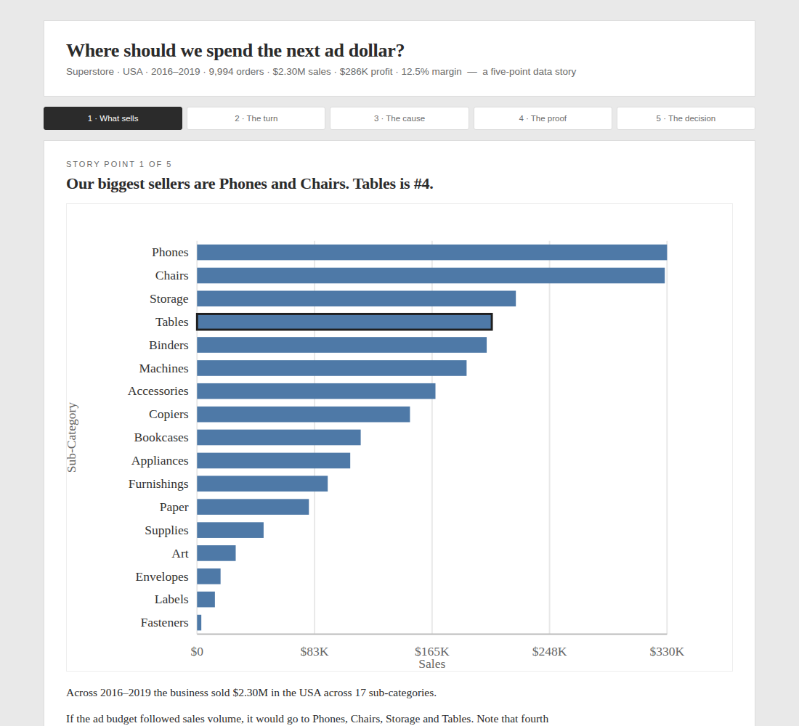
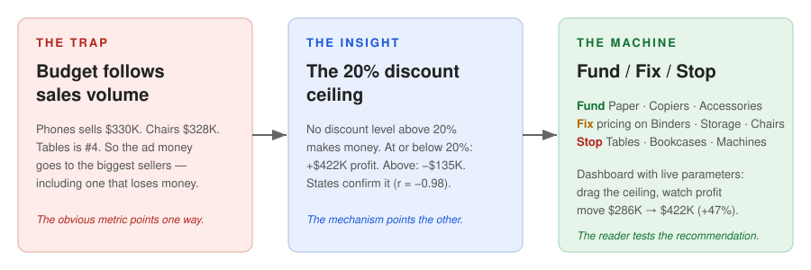

# Where Should We Spend the Next Ad Dollar?

A marketing analytics lead has an ad budget and a room full of managers who
read the business through sales volume. This dashboard makes the case for
spending it somewhere else — and lets the room test the recommendation live.

Built in Tableau for Hult's Data Visualization course (QTM-6032R). Graded
**100/100**. [Live on Tableau Public](https://public.tableau.com/app/profile/lorisca.cessia.tuuk/viz/A1_EXTRACT_v3/Story1)
· [Interactive dashboard](https://lorisca-analytics.github.io/superstore-discount-ceiling/dashboard/)

## The shape of the argument

**Trap.** Budget follows sales volume. Phones sells $330K, Chairs $328K, Tables
is #4 — so the money goes to the biggest sellers, including one that loses
$17,725.

**Insight.** The discount ceiling. No discount level above 20% makes money:
at or below 20% the business earns +$422K; above 20% it loses −$135K. The
states confirm it independently — average discount and margin correlate at
r = −0.98.

**Machine.** A dashboard with live parameters. Drag the discount ceiling to
20% and watch profit move from $286K to $422K (+47%) while keeping 86% of
orders. The reader performs the policy instead of taking the number on trust.

## The case, in STAR

**Situation.** As marketing analytics lead, defend an ad budget to management.
Management reads the business through sales volume and wants the sub-category
picture across the USA. Dataset: 9,994 order lines, 17 sub-categories,
49 states, 2016–2019.

**Task.** Build an interactive dashboard (linked charts, ≥2 actions) plus a
200–500 word management report with findings and recommendations.

**Action.** Four linked views — sales bar, sales-vs-profit scatter, discount
ladder, state map — driven by five interactions: a filter action, a hover
highlight, a Profit Target parameter with reference line, a Discount Ceiling
what-if parameter, and a type-ahead highlighter. A five-point Tableau Story
walks the argument: what sells → selling ≠ earning → the discount cause →
the map proof → Fund / Fix / Stop. Colour rule throughout: blue = profit,
orange = loss, readable for red-green colour blindness.

**Result.** The recommendation: **fund** Paper (43%), Copiers (37%),
Accessories (25%), Labels (44%), Envelopes (42%); **fix pricing first** on
Binders, Storage, Chairs; **stop** funding Tables, Bookcases, Machines,
Supplies. Capping discounts at 20% lifts profit 47% on its own.

## How it works

- [`dashboard/`](dashboard/) — the dashboard as a static page.
- [`docs/analysis.md`](docs/analysis.md) — the five story points, one idea
  each, with the verified numbers.
- [`docs/business-report.md`](docs/business-report.md) — the 407-word
  management report as submitted.
- [`docs/methodology.md`](docs/methodology.md) — parameters, calculated
  fields, discovery notes, QA log.
- [`data/`](data/) — summary tables (aggregates only; row-level data lives in
  the workbook extract).

Sample data, disclosed as such — the value is the mechanism, not the dataset.

## Links

- Live workbook (Tableau Public): https://public.tableau.com/app/profile/lorisca.cessia.tuuk/viz/A1_EXTRACT_v3/Story1
- Course: Data Visualization (QTM-6032R), Hult International Business School
